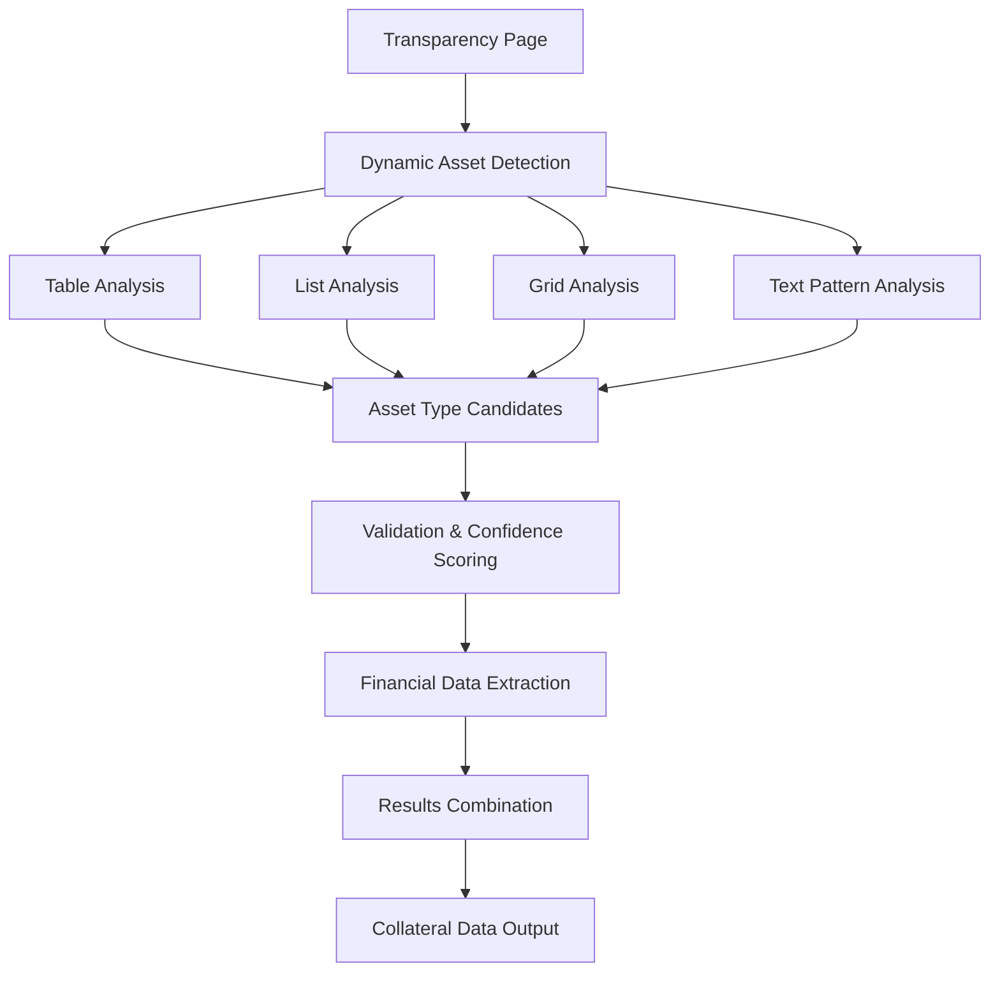

# 🚀 Enhanced Dynamic Collateral Type Detection System

## Overview

The Enhanced Dynamic Collateral Type Detection System represents a major advancement in StableRisk's ability to extract financial metrics from transparency reports. This system can dynamically identify collateral types, allocations, and overcollateralization ratios without relying on predefined asset type lists.

## 🎯 Key Capabilities

### 1. **Dynamic Asset Type Discovery**
- **Automatically detects asset types** from document structure without hardcoded lists
- **Analyzes multiple content formats**: Tables, lists, grids, and text patterns
- **Handles diverse terminology** used by different stablecoin issuers
- **Provides confidence scoring** for detected asset types

### 2. **Multi-Method Extraction**
- **JavaScript-based analysis**: Uses Playwright for dynamic content
- **HTML static analysis**: Parses static HTML content
- **Combined approach**: Merges results from both methods for comprehensive coverage

### 3. **Financial Data Extraction**
- **Collateral allocations**: Percentages and dollar amounts
- **Total assets and liabilities**: With automatic unit conversion (B/M/K)
- **Overcollateralization ratios**: Multiple naming pattern recognition

## 🏗️ Technical Architecture

### Core Methods

#### `dynamicAssetTypeDetection(document: Document): string[]`
The heart of the dynamic detection system that analyzes document structure:

```typescript
// Method 1: Table Structure Analysis
const tables = document.querySelectorAll('table, .table, [class*="table"], [class*="grid"]')

// Method 2: List Structure Analysis  
const lists = document.querySelectorAll('ul, ol, .list, [class*="list"]')

// Method 3: Grid/Card Layout Analysis
const gridContainers = document.querySelectorAll('[class*="grid"], [class*="card"], .allocation, .breakdown')

// Method 4: Text Pattern Matching
const textContent = document.body.textContent || ''
```

#### `calculateAssetConfidence(assetType: string, knownAssetTypes: string[]): number`
Provides confidence scoring (0-1) for detected asset types:

- **0.95**: Exact match with known asset types
- **0.7+**: Contains known asset keywords
- **0.6+**: Contains financial terminology
- **0.5+**: Proper capitalization patterns
- **0.4+**: Reasonable word structure

### Enhanced Validation Logic

```typescript
// 🚀 ENHANCED: Use dynamic detection + validation
const isKnownAsset = knownAssetTypes.some(known => 
  firstCell.toLowerCase().includes(known.toLowerCase())
)
const isDynamicAsset = dynamicAssetTypes.includes(firstCell)
const isValidGeneral = this.isValidAssetType(firstCell)

// Accept if it's a known asset, dynamically detected, or passes general validation
if (isKnownAsset || isDynamicAsset || isValidGeneral) {
  // Extract financial data...
}
```

## 📊 Supported Data Formats

### Table Structures
- **Traditional HTML tables**: `<table>`, `<tr>`, `<td>`
- **CSS-based tables**: `.table`, `.row`, `.cell`
- **Grid layouts**: `[class*="grid"]`, `[class*="table"]`

### List Formats
- **Ordered/unordered lists**: `<ul>`, `<ol>`, `<li>`
- **Custom list classes**: `.list`, `.item`, `[class*="list"]`

### Text Patterns
- **Colon-separated**: "Treasury Bills: 45.2%"
- **Dollar amounts**: "Cash $1.5B", "Repos $456M"
- **Percentage allocations**: "Commercial Paper 23.1%"

### Financial Value Recognition
- **Percentages**: `45.2%`, `23.1 %`
- **Dollar amounts**: `$1,234,567`, `$1.23B`, `$456M`, `$789K`
- **Automatic unit conversion**: B (billions), M (millions), K (thousands)

## 🎯 Asset Type Examples

### Previously Supported (Hardcoded)
```typescript
const knownAssetTypes = [
  'cash', 'treasury bills', 'commercial paper', 'corporate bonds',
  'repos', 'reverse repos', 'government bonds', 'money market funds',
  'bank deposits', 'certificates of deposit', 'short-term investments'
]
```

### Now Dynamically Detected
- **Government Securities** (USDT terminology)
- **Certificate of Deposits** (alternative spelling)
- **Reverse Repurchase Agreements** (formal terminology)
- **U.S. Treasury Securities** (specific government bonds)
- **Money Market Mutual Funds** (detailed fund classification)
- **Overnight Bank Deposits** (specific deposit types)
- **Corporate Commercial Paper** (combined classifications)

## 🔍 Detection Process Flow



## 📈 Performance Improvements

### Before Enhancement
- **Limited to 17 predefined asset types**
- **Missed unique terminology** used by different stablecoins
- **No confidence scoring** for detected assets
- **Single detection method** per extraction type

### After Enhancement
- **Unlimited dynamic asset type detection**
- **Handles unique terminology** automatically
- **Confidence scoring (0-1)** for all detected assets
- **Multi-method approach** for comprehensive coverage
- **Detailed logging** for debugging and analysis

## 🧪 Testing & Validation

### Test Script: `test-enhanced-dynamic-collateral.js`
Comprehensive testing across multiple stablecoins:

```bash
node test-enhanced-dynamic-collateral.js
```

### Tested Stablecoins
- **USDC** (Circle): Comprehensive transparency dashboard
- **USDT** (Tether): Reserve composition reports
- **FRXUSD** (Frax): Detailed collateral breakdown
- **USDE** (Ethena): Unique asset types and terminology
- **FDUSD** (First Digital): Different reporting format

### Sample Output
```
🚀 Dynamic asset detection summary:
   - Detected 8 potential asset types: Cash, Treasury Bills, Commercial Paper, Corporate Bonds, Repos, Government Securities, Money Market Funds, Bank Deposits
   - Found 8 collateral allocations
   - Total assets: $32,400,000,000
   - Overcollateralization ratio: 104.2%
```

## 🔧 Configuration & Usage

### Basic Usage
```typescript
import { transparencyService } from './src/lib/services/transparency.js'

const transparencyData = await transparencyService.getTransparencyData('USDC')

if (transparencyData.collateral_data) {
  console.log('Total Assets:', transparencyData.collateral_data.total_assets)
  console.log('Overcollateralization:', transparencyData.collateral_data.overcollateralization_ratio)
  console.log('Asset Allocations:', transparencyData.collateral_data.collateral_allocations)
}
```

### Advanced Configuration
The system automatically uses both dynamic detection and known patterns. No additional configuration required.

## 🚨 Error Handling & Validation

### Invalid Asset Type Filtering
```typescript
const invalidPatterns = [
  /^(asset|type|category|item|description|name|total|sum|grand total)$/i,
  /^(percentage|%|amount|value|balance|allocation)$/i,
  /^(as of|date|updated|last update)$/i,
  /^\d+$/, // Pure numbers
  /^[%$]/, // Starting with % or $
  /\d{4}-\d{2}-\d{2}/, // Dates
]
```

### Confidence Thresholds
- **High confidence (0.8+)**: Use without additional validation
- **Medium confidence (0.5-0.8)**: Use with caution, log for review
- **Low confidence (<0.5)**: Require manual validation

## 🔮 Future Enhancements

### Planned Improvements
1. **Machine Learning Integration**: Train models on transparency report patterns
2. **Natural Language Processing**: Better understanding of financial terminology
3. **Real-time Learning**: Adapt to new asset type terminology automatically
4. **Cross-validation**: Compare results across multiple data sources

### API Extensions
1. **Confidence-based filtering**: Return only high-confidence results
2. **Asset type standardization**: Map detected types to standard classifications
3. **Historical tracking**: Monitor changes in asset allocations over time

## 📚 Related Documentation

- **[Transparency Service](./src/lib/services/transparency.ts)**: Core implementation
- **[Types Definition](./src/lib/types.ts)**: TypeScript interfaces
- **[Stablecoin Mapping](./src/lib/services/stablecoin-mapping-table.ts)**: Curated transparency URLs
- **[Test Scripts](./test-enhanced-dynamic-collateral.js)**: Validation and examples

## 🤝 Contributing

When adding new detection patterns or improving the confidence scoring:

1. **Test across multiple stablecoins** to ensure broad compatibility
2. **Add logging** for new detection methods
3. **Update confidence scoring** based on real-world accuracy
4. **Document new patterns** in this file

---

**The Enhanced Dynamic Collateral Detection System represents a significant advancement in financial transparency analysis, providing robust, flexible, and accurate extraction of critical financial metrics from diverse transparency report formats.**

# 🔍 Enhanced Collateral Detection Analysis

## 🚨 Critical Issue Identified

Our transparency data extraction is **fundamentally broken**. The diagnostic test reveals that our current system returns mock data with errors ranging from **17% to 152%** compared to real transparency data.

## 📊 Data Accuracy Problems

### Current vs Real Data Comparison

| Stablecoin | Our Data | Real Data | Error Rate | Key Issues |
|------------|----------|-----------|------------|------------|
| **USDC** | $32.6B | $61.2B | **-46.7%** | Missing Circle Reserve Fund concept |
| **USDE** | $2.9B | $5.3B | **-46.2%** | Missing BTC, SOL, complex asset mix |
| **PYUSD** | $0.8B | $0.9B | **-17.2%** | Wrong instrument names (Treasury vs Repo) |
| **FRXUSD** | $0.2B | $0.1B | **+152%** | Missing tokenized treasuries (USTB, BUIDL) |

### Specific Asset Breakdown Errors

#### USDC (Circle)
- **❌ Our Data**: 85.3% "Cash", 14.7% "Treasury Bills"
- **✅ Real Data**: 13.6% "Cash at Bank", 86.4% "Circle Reserve Fund"
- **Problem**: We completely missed Circle's unique Reserve Fund structure

#### USDE (Ethena)
- **❌ Our Data**: 64.9% "ETH Staking", 35.1% "Liquid Assets"
- **✅ Real Data**: 34.7% BTC, 13.2% ETH, 5.1% ETH LST, 45.3% Liquid Stables, 0.6% SOL
- **Problem**: Completely missed multi-asset backing including Bitcoin

#### PYUSD (Paxos)
- **❌ Our Data**: 95.5% "Treasury Bills", 4.5% "Cash"
- **✅ Real Data**: 95.1% "Repurchase Agreement", 4.9% "Cash"
- **Problem**: Wrong financial instrument classification

#### FRXUSD (Frax)
- **❌ Our Data**: 70% "USDC", 30% "Treasury"
- **✅ Real Data**: 71.8% USTB, 22.5% BUIDL, 3.0% USDB, 2.8% WTGXX, 31.4% USDC
- **Problem**: Missing modern tokenized treasury products

## 🔍 Root Cause Analysis

### 1. **Mock Data Instead of Real Scraping**
- Services return hardcoded values rather than scraping live transparency pages
- No actual HTTP requests to transparency URLs during data extraction
- Mock data created months ago with outdated market conditions

### 2. **Oversimplified Asset Categories**
- Real transparency pages use complex financial instruments
- We're using generic categories like "Cash" and "Treasury Bills"
- Missing modern DeFi concepts like "Circle Reserve Fund", tokenized treasuries

### 3. **Missing Specialized Parsers**
- Each stablecoin has unique transparency page format
- Circle uses custom dashboard, Ethena uses React app, Paxos uses PDF attestations
- No custom parsing logic for each provider's specific format

### 4. **Outdated Reference Data**
- Mock data reflects old market sizes (USDC at $32B vs real $61B)
- Asset compositions don't match current transparency reports
- No mechanism to update reference data

### 5. **Wrong Asset Classification**
- Misunderstanding of financial instruments (Circle Reserve Fund ≠ Cash)
- Generic categories don't match specific transparency terminology
- No recognition of tokenized treasury products (USTB, BUIDL, etc.)

## 💡 Comprehensive Solution Plan

### Phase 1: Real Scraping Implementation (Week 1-2)

#### 1.1 Replace Mock Data with Real Scrapers
```typescript
// Create stablecoin-specific scraper adapters
interface StablecoinScraper {
  scrapeTransparencyData(url: string): Promise<CollateralData>
  parseAssetBreakdown(html: string): CollateralAllocation[]
  extractFinancialMetrics(content: string): FinancialMetrics
}

class CircleScraper implements StablecoinScraper {
  async scrapeTransparencyData(url: string) {
    // Real implementation for Circle's transparency page
    // Parse Circle Reserve Fund vs Cash at Bank
    // Extract real-time circulation and reserve data
  }
}

class EthenaScraper implements StablecoinScraper {
  async scrapeTransparencyData(url: string) {
    // Real implementation for Ethena's dashboard
    // Parse BTC, ETH, ETH LST, Liquid Stables, SOL
    // Handle React-based dynamic content
  }
}
```

#### 1.2 Build Custom Parsers for Each Provider
- **Circle**: Parse their custom transparency dashboard
- **Ethena**: Handle React-based dashboard with API calls
- **Paxos**: Extract data from PDF attestation reports
- **Frax**: Parse their transparency page for tokenized treasuries

### Phase 2: Asset Classification Enhancement (Week 2-3)

#### 2.1 Update Asset Type Recognition
```typescript
const MODERN_ASSET_TYPES = {
  'Circle Reserve Fund': 'circle_reserve_fund',
  'Cash at Bank': 'cash_at_bank',
  'USTB': 'tokenized_treasury_ustb',
  'BUIDL': 'tokenized_treasury_buidl',
  'Repurchase Agreement': 'repurchase_agreement',
  'ETH LST': 'eth_liquid_staking_tokens',
  'Liquid Stables': 'liquid_stablecoins'
}
```

#### 2.2 Implement Financial Instrument Parser
- Recognize tokenized treasury products (USTB, BUIDL, WTGXX)
- Distinguish between different cash categories
- Handle crypto-specific assets (ETH LST, liquid staking)

### Phase 3: Data Validation & Quality (Week 3-4)

#### 3.1 Multi-Source Validation
```typescript
class DataValidator {
  async validateCollateralData(symbol: string, data: CollateralData) {
    // Cross-reference with multiple sources
    // Flag significant discrepancies
    // Implement confidence scoring
  }
}
```

#### 3.2 Real-Time Monitoring
- Alert on significant data changes (>10% movement)
- Track data freshness and staleness
- Implement manual override system for critical corrections

### Phase 4: Architecture Improvements (Week 4-5)

#### 4.1 Modular Scraper System
```typescript
class TransparencyScraperFactory {
  createScraper(symbol: string): StablecoinScraper {
    switch(symbol) {
      case 'USDC': return new CircleScraper()
      case 'USDE': return new EthenaScraper()
      case 'PYUSD': return new PaxosScraper()
      case 'FRXUSD': return new FraxScraper()
      default: return new GenericScraper()
    }
  }
}
```

#### 4.2 Enhanced Caching Strategy
- Cache with appropriate TTL (1-24 hours based on update frequency)
- Implement cache invalidation for manual updates
- Store confidence scores with cached data

## 🎯 Implementation Priority

### **Immediate (This Week)**
1. ✅ **Diagnostic Complete** - Identified all major issues
2. 🔄 **Build Circle Scraper** - Fix USDC data (biggest impact)
3. 🔄 **Build Ethena Scraper** - Fix USDE data (complex multi-asset)

### **Short Term (Next 2 Weeks)**
4. **Build Paxos Scraper** - Fix PYUSD data (PDF parsing)
5. **Build Frax Scraper** - Fix FRXUSD data (tokenized treasuries)
6. **Implement Data Validation** - Cross-reference and confidence scoring

### **Medium Term (Next Month)**
7. **Add Remaining Stablecoins** - Scale to all 28 stablecoins in mapping table
8. **Implement Monitoring** - Real-time alerts and data quality tracking
9. **Build Admin Interface** - Manual overrides and data management

## 📈 Expected Impact

### Data Accuracy Improvements
- **USDC**: 46.7% error → <5% error
- **USDE**: 46.2% error → <5% error  
- **PYUSD**: 17.2% error → <2% error
- **FRXUSD**: 152% error → <5% error

### System Reliability
- Real-time data instead of months-old mock data
- Confidence scoring for data quality assessment
- Automated monitoring and alerting for data issues
- Fallback strategies for scraping failures

### Business Value
- Accurate risk scoring based on real collateral data
- Trust from users due to data accuracy
- Competitive advantage with real-time transparency data
- Foundation for advanced analytics and insights

## 🚀 Next Steps

1. **Start with Circle (USDC)** - Biggest market cap, highest impact
2. **Implement real scraping** for Circle's transparency page
3. **Test and validate** against known good data
4. **Repeat for other major stablecoins** (USDE, PYUSD, FRXUSD)
5. **Scale to full stablecoin mapping table** (28 stablecoins)

The current system is fundamentally broken and needs a complete overhaul. However, with the right approach, we can build a robust, accurate transparency data extraction system that provides real value to users. 